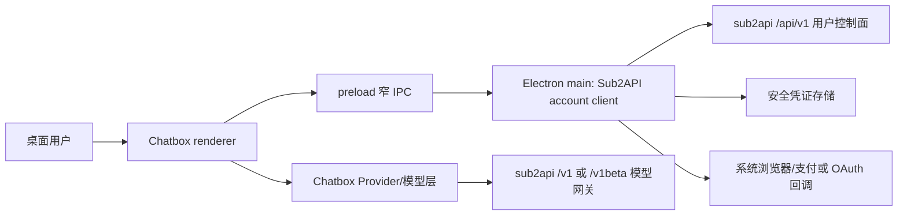

# 架构说明

### Runtime ownership boundary

Chatbox remains the code baseline only. The default product runtime does not use Chatbox-hosted configuration, model catalogs, onboarding, telemetry, hosted parsing, hosted search, skill synchronization, or hosted MCP endpoints. Default model traffic is OpenAI-compatible and may be bound to the configured sub2api service. Legacy Chatbox enums, schemas, migrations, and unreachable compatibility components remain only for reading historical data; they must not be reintroduced into the default provider or startup path.

## 仓库现状

当前仓库已导入 Chatbox Community Edition 基线，现有运行架构即下述 Electron/React/TypeScript 上游架构。第二批已经实现 sub2api 控制面的共享契约、主进程内存会话、HTTP client 和窄业务 IPC；账户 UI、API Key 管理和模型 Provider 仍是目标架构。

## Chatbox 上游架构

从 2026-08-05 基线确认：

- Electron 35 + React 18 + TypeScript。
- 使用 `electron-vite` 构建，目录分为 `src/main`、`src/preload`、`src/renderer`、`src/shared`。
- Provider 使用注册表架构；OpenAI 兼容服务可通过自建 Provider 接入，也可新增内置 Provider。
- Provider 模型实现、设置、模型注册表和 OAuth 能力已有清晰扩展点。
- Node 版本文件为 `v22.14.0`，`package.json` 要求 Node `>=22.13.0 <23`、pnpm `>=10.17.0`。
- 单元/集成测试使用 Vitest；桌面 E2E 使用锁定的 Playwright 版本，针对生产构建执行隔离用户目录的启动与品牌烟测。真实模型 Provider 测试默认排除。

主要目录：

| 目录 | 职责 |
| --- | --- |
| `src/main` | Electron 主进程、OAuth、本地服务、文件系统与系统能力 |
| `src/preload` | 主进程与 renderer 的受控桥接 |
| `src/renderer` | React UI、路由、状态、设置和模型调用编排 |
| `src/shared` | Provider、模型、类型、请求和跨平台业务逻辑 |
| `test/integration` | 文件会话、上下文、Provider 等集成测试 |

上游启动与测试命令：

```powershell
pnpm install --frozen-lockfile
pnpm dev
pnpm check
pnpm lint
pnpm test
pnpm test:e2e
```

## sub2api 上游架构

从 2026-08-05 基线确认：

- 后端：Go、Gin、Ent；依赖 PostgreSQL 和 Redis。
- 前端：Vue 3、TypeScript、Vite、Pinia、Axios。
- 部署：预编译二进制、Docker Compose 或源码构建。
- 后端将前端构建产物嵌入二进制。
- API 分成普通用户控制面、管理员控制面和模型网关。

版本存在上游文档不一致：`backend/go.mod` 和当前 CI 使用 Go 1.26.5；README/DEV_GUIDE 仍写 Go 1.25.7 或更低前置条件。开发时应以 `go.mod` 和 CI 为准，同时把上游文档差异视为待跟踪项。

主要接口边界：

| 边界 | 认证 | 用途 |
| --- | --- | --- |
| `/api/v1/auth/*` | 匿名或 JWT | 登录、注册、刷新、OAuth、2FA |
| `/api/v1/user/*` 等 | 用户 JWT | 资料、安全、API Key、用量、订阅、兑换、公告、渠道 |
| `/api/v1/payment/*` | 用户 JWT；少量公开回调 | 套餐、订单、支付、退款申请 |
| `/api/v1/admin/*` | 管理员 | 不在本项目普通用户范围 |
| `/v1/*` | 用户 API Key | OpenAI/Responses/Claude 风格网关、模型、图片、视频等 |
| `/v1beta/*` | 用户 API Key | Gemini 风格网关 |

sub2api 前后端本地开发：

```powershell
cd backend
go run ./cmd/server
go test ./...
golangci-lint run ./...

cd ../frontend
pnpm install --frozen-lockfile
pnpm dev
pnpm run typecheck
pnpm run test:run
```

这些命令用于上游分析参考；本仓库目前未包含 sub2api 源码，不能在本仓库直接执行。

## 已确认目标架构



集成拆成两个明确子系统：

1. 数据面：Chatbox Provider 使用用户 API Key 调用 sub2api 模型网关。
2. 控制面：桌面账户中心使用用户 JWT 调用 sub2api `/api/v1`，管理 API Key、用量、订阅、订单和资料。

两个凭证用途不同，不能互换。用户登录后，可以通过控制面创建或选择 API Key，再由应用把它绑定到 sub2api Provider。

### 实现边界

- `src/shared/constants.ts`：固定的公开 sub2api 服务根地址；所有适配层从该常量派生 URL，不重复硬编码。
- `src/shared`：sub2api API DTO、错误模型、能力模型和纯函数。
- `src/main`：控制面 HTTP client、token refresh 单飞、凭证存储、外部浏览器回调。
- `src/preload`：按业务动作暴露受控 IPC，不暴露任意 HTTP 或原始令牌读取。
- `src/renderer`：账户中心路由、查询缓存、表单和状态展示。
- Provider 层：新增明确的 `sub2api` 内置 Provider，或先用自建 OpenAI Provider 完成协议验证。

通过 API 对接远程 sub2api、以 Chatbox 为客户端基线的总体边界已经确认。当前实现细节：

- `src/shared/sub2api/`：Zod 运行时 schema、错误类型、固定路由、URL 构造和 renderer API 类型。
- `src/main/sub2api/session.ts`：access/refresh token 与 2FA temp token 仅驻留主进程内存；renderer 只得到非敏感会话状态；凭证代际用于隔离并发会话变化。
- `src/main/sub2api/client.ts`：控制面请求、401 retry、refresh 单飞、令牌轮换、失败清理和旧会话响应丢弃。
- `src/main/sub2api/ipc-handlers.ts`：公共设置、登录、2FA、登出、会话状态和当前用户固定动作；调用方必须是当前主窗口的受信 renderer frame。
- `src/preload/index.ts`：静态 `sub2api` 方法桥，不提供任意 URL、header 或原始令牌读取能力。

跨重启安全持久化尚未实现。Electron `safeStorage`、系统 Keychain/Credential Vault 的不可用策略、迁移和三平台行为待独立验证。现有通用 `electronAPI.invoke` 和 Store IPC 是全局安全遗留，新增 sub2api 令牌不得进入这些 Store。主窗口已阻止不受信顶层导航，但 `webSecurity: false` 和既有 IPC 仍需独立治理。

## 普通用户能力映射

| 能力 | 已确认接口或模块 | 建议阶段 |
| --- | --- | --- |
| 登录、刷新、退出、找回密码 | `/api/v1/auth/*` | 第一阶段 |
| 2FA、Passkey、OAuth | `/api/v1/auth/*`、`/api/v1/user/totp/*`、`passkeys` | 第一至三阶段 |
| API Key 管理 | `/api/v1/keys` | 第一阶段 |
| 模型调用与模型列表 | `/v1/models`、`/v1/chat/completions`、`/v1/responses` 等 | 第一阶段 |
| 用户概览和用量 | `/api/v1/usage/*` | 第二阶段 |
| 订阅、额度、平台配额 | `/api/v1/subscriptions/*`、`/api/v1/user/platform-quotas` | 第二阶段 |
| 套餐、订单、支付、退款申请 | `/api/v1/payment/*` | 第三阶段 |
| 兑换码 | `/api/v1/redeem` | 第二阶段 |
| 资料、通知邮箱、账户绑定 | `/api/v1/user/*` | 第三阶段 |
| 渠道、公告、监控 | `/api/v1/channels`、`announcements`、`channel-monitors` | 第三阶段 |
| 批量图片 | `/v1/images/batches/*` | 第四阶段/待确认 |

## 方案比较

| 方案 | 可行性 | 结论 |
| --- | --- | --- |
| 仅配置 Chatbox 自建 Provider | 高 | 可快速验证模型调用，但不能覆盖账户自助功能 |
| 在 Chatbox 内通过 API 原生实现 sub2api 用户控制面 | 高 | 已选；体验和权限边界最好，开发量中等偏高 |
| WebView/iframe 直接嵌入 sub2api 前端 | 中 | 原型快，但登录、导航、CSP、跨域、安全和桌面体验较差 |
| 把 sub2api 前后端一起打包进客户端 | 低 | 与现有远程部署目标冲突，运维和数据安全复杂，不建议 |

## 关键风险

- 安全：renderer 中存储 refresh token 会扩大 XSS/依赖注入后的影响范围。
- API 稳定性：sub2api 没有在本次分析中发现面向客户端的版本化 OpenAPI 契约，需建立契约快照或适配层。
- 支付/OAuth：第三方页面和回调不可能全部原生化，需定义“应用内发起、外部完成、应用内确认”的体验。
- CORS/CSP：直接从 renderer 请求远程控制面可能被限制，主进程代理更稳妥。
- 上游同步：Chatbox 更新活跃，长期 fork 需要控制改动面并持续回归 Provider/设置/路由。
- 许可证：分发修改版 Chatbox 需要满足 GPL-3.0；具体发布义务需在发布前审查。
- 服务模式：sub2api 的 simple/standard 模式会改变可见功能，客户端需要能力探测而不是写死页面。
- IPC：上游 preload 暴露通用 `invoke`；新增 sub2api handler 已校验 sender，但不能据此宣称 renderer 已具备全局严格 capability boundary。
- Electron：当前窗口使用 `webSecurity: false`；不受信顶层导航已经阻止，账户 UI 接入前仍需要专项移除评估和回归验证。

## 待确认

- 已部署 sub2api 的版本、运行模式、公开根地址和 HTTPS 情况。
- 是否能为桌面端补充稳定的能力发现/版本接口。
- 令牌安全存储是否采用操作系统 Keychain/Credential Vault；Chatbox 现有能力能否直接复用需技术验证。
- 多实例、账号切换和离线只读缓存是否属于首发范围。
- 支付和 OAuth 回调允许使用外部浏览器还是必须使用应用内窗口。
